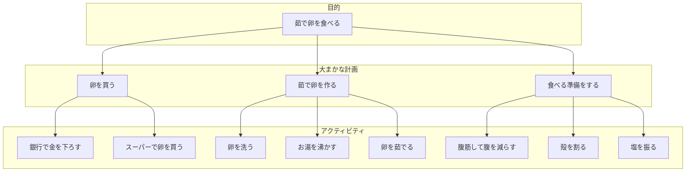

```mermaid
flowchart TB
    subgraph 目的
    first[茹で卵を食べる]
    end
    subgraph 大まかな計画
    second1[卵を買う]
    second2[茹で卵を作る]
    second3[食べる準備をする]
    end
    first-->second1
    first-->second2
    first-->second3
    subgraph アクティビティ
    second1-->third1[銀行で金を下ろす]
    second1-->third2[スーパーで卵を買う]
    second2-->third3[卵を洗う]
    second2-->third4[お湯を沸かす]
    second2-->third5[卵を茹でる]
    second3-->third6[腹筋して腹を減らす]
    second3-->third7[殻を割る]
    second3-->third8[塩を振る]
    end
```